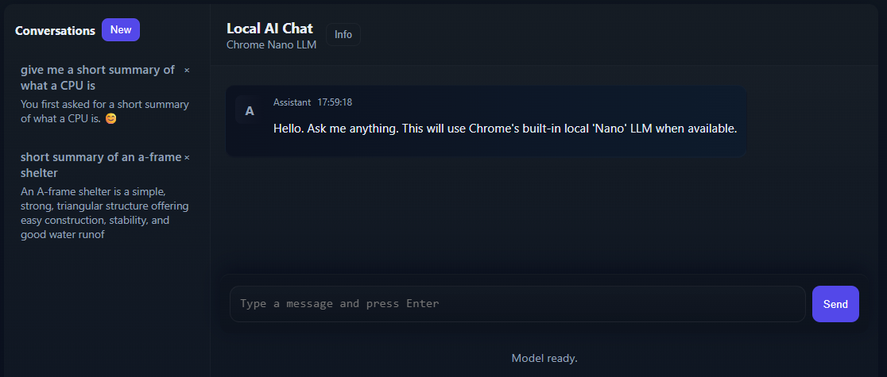

This is a simple UI for the built-in 'Nano' LLM that Google shipped in Chrome v148. Their Nano AI is a 4Gb model that can be used for local AI processing, with no cloud interaction.

I've designed this lightweight local chat UI that will interact with the AI using a chat interface that's similar to the big platforms you're familiar with. 

Conversations are stored locally (IndexedDB with a localStorage fallback) so history persists across page loads. It runs entirely in your browser and does not send your data to external servers.

All the files to run it can be saved to your PC and won't need subsequent internet access.

You can access the chat interface online here;
https://mattcuk.github.io/chrome-ai-front-end/gai.html
